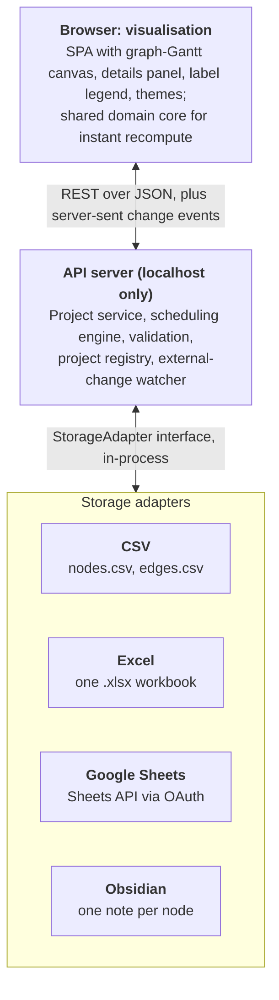

# PRD — Project Dependency Manager

As of 2026-10-05 · Living copy: [PRD — Project Dependency Manager](https://claude.ai/code/artifact/73bc9b9a-f914-42d7-a656-657528ffff5d)

> **Scope note (2026-10-08):** the Excel, Google Sheets and Obsidian stores described below were built and then removed to focus on CSV. Storage stays behind the adapter interface so they can return; see the README's Storage section.

## Overview

Project Dependency Manager is a locally run web app that models a project as a dependency graph rooted in its success criteria, and shows when each item can realistically finish. It is laid out as a graph-based Gantt chart: every node sits on a time axis, and every edge is a real dependency. Data lives in tools people already use (CSV, Excel, Google Sheets, Obsidian), in a form they can read and edit by hand.

This PRD is written to be executed by coding agents. Requirements carry IDs (FR-, NFR-), and delivery is a sequence of thin end-to-end slices, each built test-first.

### Problem

Gantt tools model time but hide why a date is what it is; dependency graphs show structure but not time. Planners need both at once: what the success criteria depend on, which chain drives the finish date, and what moves when one item slips. They also want the plan in plain files or sheets, not locked in a SaaS database.

### Goals

- G1. Model a project as one graph with a single top-level success-criteria node.
- G2. Compute each node's completion time from work time, not-before date and its dependencies, and recompute instantly on every edit.
- G3. Detect and highlight cyclic dependencies without breaking the rest of the plan.
- G4. Make dependency chains legible: selection highlighting, animated edges, colour-coded labels.
- G5. Read and write projects in CSV, Excel, Google Sheets and Obsidian, human-editable in all but CSV.
- G6. Ship in thin vertical slices, each one tested end to end and built with TDD.

### Non-goals (v1)

- Multi-user real-time collaboration, accounts or hosting.
- Resource levelling, cost tracking or working-day calendars (time is wall-clock).
- Progress tracking (percent complete, actuals).
- Mobile-first layout; desktop browser is the target.

## Users and use cases

The primary user is a technical lead or planner running the app on their own machine, who owns one or more projects and edits them both in the app and directly in the backing files.

| ID | As a planner, I want to… | So that… |
| --- | --- | --- |
| UC1 | create a project with its success-criteria node | the plan starts from the outcome, not the task list |
| UC2 | add dependency nodes from any node and see dates update immediately | I can build the plan by asking "what does this need?" |
| UC3 | click a node to see work time, not-before date, dependency time, description and links | I understand why it lands when it does |
| UC4 | select a node and see what it depends on and what depends on it | I can judge the blast radius of a slip |
| UC5 | be told when I have created a cycle, and where | I can fix the plan rather than trust a wrong date |
| UC6 | tag nodes with labels and colour them from a legend | I can see ownership, workstream or risk at a glance |
| UC7 | reference another project's success node as a dependency | I can link plans without duplicating them |
| UC8 | open or import a project from CSV, Excel, Google Sheets or Obsidian | the plan lives where my team already works |
| UC9 | edit the sheet or notes by hand and see the change in the app | the files stay a first-class editing surface |
| UC10 | pick a UI style | the app suits my taste and my screen |

## Domain model and scheduling rules

A node finishes at its work time added to the later of its not-before date and its dependency time; cycles make that undefined, so they are flagged and excluded rather than guessed. The scheduling engine is a pure function in a shared domain package, so the browser and the server compute identical results.

### Entities

| Entity | Fields | Rules |
| --- | --- | --- |
| Project | id, name, start (date-time), rootNodeId, labels, storage descriptor | Exactly one root node: the success criteria. `start` anchors nodes with no not-before date and no dependencies. |
| Node | id (stable, e.g. ULID), title, workTime (duration), notBefore (date-time, optional), description (markdown), links (list of URL + title), labels (list) | Title and workTime are required. Computed fields are never stored as inputs. |
| Reference node | id, title, ref = {projectId, storage descriptor} | Stands in for another project's root node. Its completion is the referenced root's completion. Read-only in this project. |
| Dependency (edge) | dependentId, dependencyId | Directed: the dependent cannot complete before the dependency. Self-edges and cycles are allowed but flagged. Duplicate edges are rejected. |
| Label | key, value (optional), colour | Arbitrary text, e.g. `team:platform` or `risk`. Colour is set per label in the project. |

Durations are wall-clock (calendar) time, entered as human strings such as `3d`, `4h` or `1w 2d`, and stored in that form in human-readable stores.

### Computed fields

For each node n, with D(n) its direct dependencies:

```latex
\text{dependencyTime}(n) = \max_{d \in D(n)} \text{completion}(d)
```

```latex
\text{completion}(n) = \max\big(\text{notBefore}(n),\ \text{dependencyTime}(n)\big) + \text{workTime}(n)
```

- A missing not-before date or an empty dependency set drops out of the max. If both are missing, the project start is used.
- start(n) = completion(n) − workTime(n); this is the bar's left edge on the Gantt axis.
- The node's displayed headline time is completion(n), as a wall-clock date-time.
- The critical dependency of n is the dependency whose completion set dependencyTime(n); ties pick all of them. This drives the critical-path highlight.
- Example: notBefore 1 Nov, dependencies finishing 30 Oct and 4 Nov, workTime 2d → completion 6 Nov.

### Cycles

- The engine finds strongly connected components (Tarjan, O(V+E)). Every node in a component with more than one node, or with a self-edge, is marked `cyclic`.
- Cyclic nodes have no dependencyTime or completion; they show "cycle" in place of a date.
- Any node that depends, directly or transitively, on a cyclic node is marked `blockedByCycle` and also has no computed dates, because its sub-graph cannot be timed.
- Nodes outside the cycle's downstream are computed normally; one cycle never blanks the whole plan.
- Cycle detection spans reference nodes: if project A references B's root and B references A's, both roots are flagged.

### Graph integrity

- Nodes not reachable from the root are allowed while editing but flagged as `orphan`.
- Deleting a node removes its edges; deleting the root is refused.
- A reference to a project that cannot be loaded shows `unresolved` and blocks its dependents like a cycle does.

## Functional requirements

The UI is one canvas per project: a time-scaled graph with a details panel, a label legend and a style switcher.

### Graph view (graph-based Gantt)

- FR-1. Each node renders as a bar on a horizontal time axis from start(n) to completion(n), showing its title and completion date-time.
- FR-2. Rows are assigned by a layered layout so edges mostly run left to right and crossings are minimised; the root sits at the far right.
- FR-3. Edges are drawn from dependency to dependent, routed around bars.
- FR-4. Cyclic nodes, blocked nodes and their cyclic edges render with a distinct warning style and a "cycle" badge; a banner lists each cycle with links to its nodes.
- FR-5. Pan, zoom (hours to quarters), fit-to-view and a "today" marker. Undated nodes (cyclic or blocked) sit in a separate band at the bottom.
- FR-6. Reference nodes have a distinct shape and an "open project" action.

### Node details

- FR-7. Clicking a node expands it in place (or in a side panel on narrow screens) to show work time, not-before date, dependency time, completion, full description (rendered markdown) and external links.
- FR-8. All input fields are editable in the expanded view; edits validate inline (duration syntax, date format, required title).

### Editing and live recompute

- FR-9. "Add dependency" on a node creates a new node and the edge in one action, with the title field focused.
- FR-10. Users can connect two existing nodes by dragging from one node to another, and delete edges and nodes.
- FR-11. Every edit recomputes the schedule and re-renders within 100 ms for a 500-node project, then persists through the API.
- FR-12. Edits are optimistic in the UI. A failed save rolls back the change and shows the reason.
- FR-13. Undo and redo cover all graph edits within the session.

### Selection and animation

- FR-14. Selecting a node highlights its dependencies (upstream) and all nodes that depend on it (downstream) in two distinct colours; everything else dims.
- FR-15. On selection, the edges in the highlighted chains animate as dashed lines flowing from dependency to dependent. Dash speed is scaled to the dependency's work time: longer work, slower flow.
- FR-16. The critical chain to the selected node is emphasised over non-critical upstream edges.
- FR-17. Animation respects `prefers-reduced-motion` by switching to static dashes.

### Labels

- FR-18. Users can add any number of free-text labels to a node, with autocomplete from labels already in the project.
- FR-19. A legend lists every label in the project with its colour and node count.
- FR-20. Each label has a user-chosen colour (picker plus a preset palette); the colour is saved with the project.
- FR-21. Clicking a label in the legend toggles highlighting of its nodes in that colour; several labels can be active at once, and a node with two active labels shows both.

### UI styles

- FR-22. At least four styles ship in v1: Light, Dark, High contrast and one distinctive style (e.g. Blueprint). Styles are themes over one set of design tokens, switchable at runtime and remembered per user.

### Projects, open and import

- FR-23. A start screen lists recent projects and offers New, Open and Import.
- FR-24. Open connects to an existing project in place: the store stays the source of truth and edits are written back to it.
- FR-25. Import reads a project from one store and writes a copy into another chosen store and format.
- FR-26. When the backing store changes outside the app (file edited, sheet edited), the app detects it on focus or by polling and reloads, warning first if there are unsaved local edits.
- FR-27. Export to CSV is always available, whatever the source store.

## Architecture

Three tiers — browser visualisation, a local API server, and one storage adapter per store — share a single domain package that owns the model, validation and scheduling engine.



The server is the source of truth for saved state; the browser runs the same engine for instant feedback, then reconciles with the server's response.

### Recommended stack

- TypeScript monorepo (pnpm workspaces): `packages/domain`, `packages/adapters/*`, `apps/server`, `apps/web`.
- Web: React + Vite; graph canvas in SVG via React Flow (or hand-rolled SVG), layered layout via ELK.js; design tokens in CSS custom properties for themes.
- Server: Fastify, bound to 127.0.0.1 only.
- Libraries: exceljs (Excel), googleapis (Sheets), gray-matter (Obsidian frontmatter), csv-parse / csv-stringify.
- Tests: Vitest, fast-check (property tests), Playwright (end to end).

The stack is a recommendation; the tier boundaries, API contract and adapter interface below are the requirement.

### API contract

| Method and path | Purpose | Notes |
| --- | --- | --- |
| GET /api/projects | Recent and registered projects | Registry kept in a local config file |
| POST /api/projects | Create a project in a chosen store | Body: name, start, root title, storage descriptor |
| POST /api/projects/open | Open an existing project in place | Body: storage descriptor; returns project, schedule, version |
| POST /api/projects/import | Copy a project between stores | Body: source and target descriptors |
| GET /api/projects/:id | Project, computed schedule, version | Schedule includes cyclic, blockedByCycle, orphan flags |
| POST /api/projects/:id/commands | Apply a batch of edit commands | Body: expectedVersion + commands (addNode, updateNode, deleteNode, addEdge, removeEdge, setLabelColour); 409 on version conflict, 422 on validation |
| GET /api/projects/:id/events | Server-sent events | saved, externalChange, conflict |
| GET /api/projects/:id/export?format=csv | Export | Always available |
| GET /api/auth/google/start | Google OAuth (loopback redirect) | Tokens kept in the OS keychain |

Commands, not whole-document PUTs, keep edits small, make undo simple and give adapters a diff to apply.

### Storage adapter interface

Every adapter implements one interface and passes one shared conformance suite:

- `probe(descriptor)` — can this location be read, and is it an existing project?
- `create(descriptor, project)` → version
- `load(descriptor)` → project + version
- `save(descriptor, project, expectedVersion)` → new version, or a conflict error
- `watch(descriptor, onChange)` (optional) → unsubscribe; otherwise the server polls the version.
- `capabilities` — e.g. watch support, human-readable, single file versus folder.

Rules for all adapters:

- Round-trip fidelity: content the app does not own (extra columns, sheet formatting, note body text, unknown frontmatter keys) survives a save.
- Writes are atomic for files (write to temp, then rename) and keep the previous version as a `.bak`.
- Stable node IDs are stored in every format; titles are free to change.
- Version = content hash or mtime for files, Drive revision for Sheets.
- Computed fields (dependency time, completion) may be written as read-only output columns for human readers but are never read back as input.

### Store formats

CSV is machine-first; the other three are designed to be read and edited by hand.

**CSV** — a folder holding `project.csv` (one row of project metadata), `nodes.csv` and `edges.csv`:

```csv
id,title,work_time,not_before,labels,description,links
n01,Public beta live,2d,,risk;team:web,"Beta open to all sign-ups",https://example.com/beta
n02,Payments integration,1w,2026-11-02,team:platform,,
```

**Excel and Google Sheets** — the same layout in both: a `Project` sheet, a `Tasks` sheet with one row per node and a `Depends on` column listing dependency titles separated by semicolons (IDs kept in a narrow ID column), a `Labels` sheet with label and colour (cell filled in that colour), and greyed-out computed columns `Starts` and `Completes`. Dates are real date cells; durations stay as text like `3d`. Columns use friendly headers (Title, Work time, Not before, Labels, Description, Links).

**Obsidian** — a folder in a vault, one markdown note per node, the root note named after the project. Dependencies are wikilinks, so Obsidian's own graph view shows the plan:

```markdown
---
id: n02
work_time: 1w
not_before: 2026-11-02
depends_on:
  - "[[API contract agreed]]"
labels: [team/platform]
links:
  - https://example.com/spec
---
Integrate the payment provider and run the sandbox certification.
```

Labels map to Obsidian tags; label colours live in the project note's frontmatter. Renaming a note in Obsidian is handled by matching on `id`.

## Non-functional requirements

| ID | Area | Requirement |
| --- | --- | --- |
| NFR-1 | Performance | Schedule recompute under 20 ms for 2,000 nodes and 5,000 edges; render and pan at 60 fps for 500 visible nodes. |
| NFR-2 | Performance | Open a 500-node project from local files in under 2 s. |
| NFR-3 | Data safety | No silent data loss: atomic writes, `.bak` of the previous version, version-checked saves, conflict prompt on external edits. |
| NFR-4 | Fidelity | Load then save without edits produces no semantic change in any store (enforced by the conformance suite). |
| NFR-5 | Security | Server binds to 127.0.0.1 only, with a per-launch token checked on every request; OAuth tokens stored in the OS keychain, never in project files. |
| NFR-6 | Offline | Every store except Google Sheets works with no network. |
| NFR-7 | Accessibility | Keyboard navigation of nodes and edges, visible focus, WCAG 2.2 AA contrast in every built-in style, reduced-motion support. Label highlighting never relies on colour alone (outline pattern or badge as well). |
| NFR-8 | Portability | Runs on macOS, Windows and Linux with one command (`npx` or a packaged binary); current Chrome, Firefox and Safari. |
| NFR-9 | Determinism | The scheduler and layout give identical output for identical input, so tests and screenshots are stable. |
| NFR-10 | Observability | Structured server logs with a request ID; adapter errors name the file, sheet or note and the line or row at fault. |

## Delivery plan

Delivery runs as 12 thin slices; each cuts through browser, API and storage, is demoable on its own, and ends with a passing end-to-end test. CSV comes first because it is the simplest store; the richer stores arrive once the model is stable. Slices run in order unless marked parallel.

| Slice | User-visible outcome | Tiers touched | Acceptance criteria (each becomes an end-to-end test) |
| --- | --- | --- | --- |
| S0 Walking skeleton | Open a CSV project and see its root node | All three, CSV adapter (load only) | Given a CSV folder with one root node, opening it shows the root title and completion = project start + work time. CI runs unit, contract and Playwright suites. |
| S1 Add a dependency | Add a dependency node; dates update and persist | Domain, API commands, web, CSV save | Adding a 3d dependency to a 2d root moves the root's completion out by 3d on screen and in `nodes.csv`/`edges.csv`; reload shows the same. |
| S2 Full scheduling and details | Not-before dates, dependency time, expandable node details | Domain, web | Clicking a node shows work time, not-before, dependency time, completion, rendered description and links. The worked example in Computed fields passes. Edits to any field recompute instantly. |
| S3 Graph-Gantt layout | Bars on a time axis with layered rows | Web | Bars span start to completion; edges run dependency to dependent; zoom, pan, fit and today marker work; layout is deterministic (screenshot test). |
| S4 Cycles | Cycles flagged, downstream not timed | Domain, web | Creating A→B→A marks both cyclic, marks their dependents blocked and leaves unrelated nodes dated; banner lists the cycle; removing an edge restores dates. |
| S5 Selection and animation | Upstream and downstream highlight, animated edges | Web | Selecting a node highlights its dependencies and all dependents in distinct colours and dims the rest; dashes flow toward the dependent at a speed scaled to work time; reduced motion gives static dashes. |
| S6 Labels | Labels, legend, colours, highlight | Domain, API, web, CSV | Adding labels updates the legend counts; choosing a colour persists; toggling two labels highlights the union with both colours visible. |
| S7 Excel adapter | Open, edit and import into Excel | Adapter, API, web | Conformance suite passes; a workbook edited by hand in Excel opens correctly; import from CSV to Excel produces the documented sheet layout; extra columns survive a save. |
| S8 Obsidian adapter (parallel with S9) | Open and edit a vault folder | Adapter, API, web | Conformance suite passes; dependencies appear as wikilinks; renaming a note in Obsidian keeps its edges; note body text survives a save. |
| S9 Google Sheets adapter (parallel with S8) | Sign in, open and edit a Google Sheet | Adapter, API auth, web | Conformance suite passes against a test spreadsheet (or recorded fixtures in CI); OAuth via loopback; external edits detected within 10 s. |
| S10 Cross-project references | Reference another project's root | Domain, API registry, web | A reference node shows the other project's root completion and updates when it changes; cross-project cycles are flagged; an unloadable reference shows unresolved. |
| S11 UI styles | Four switchable styles | Web | Each style passes automated contrast checks and a screenshot test; choice persists across launches. |

External-change detection (FR-26), undo and redo (FR-13) and CSV export (FR-27) land in the first slice whose store or feature needs them, not as separate slices.

## Engineering process

Every slice starts with a failing end-to-end test from its acceptance criteria, and every component changed in the slice is driven by failing unit tests first.

### Slice workflow for implementing agents

1. Read the slice row, the requirements it cites and the current code; write a short plan in the slice's PR description.
2. Write the slice's Playwright test from the acceptance criteria. Run it and confirm it fails for the right reason.
3. Work outside-in through the tiers. For each component touched: write a failing unit or contract test, make it pass with the simplest code, refactor with tests green.
4. Run the full suite (unit, property, contract, end to end, lint, type check). All green is the only exit.
5. Update this PRD's open questions if the slice surfaced a decision, and the README if behaviour or setup changed.
6. One slice per branch and PR. Do not start the next slice until the current one is merged.

### Tests per tier

| Tier | Test kinds | Must cover |
| --- | --- | --- |
| Domain | Unit, property (fast-check) | Scheduling formula, duration parsing, cycle and blocked marking, command application. Properties: completion(n) ≥ completion(d) for every acyclic edge; adding an edge never makes a dependent finish earlier; results are independent of node order. |
| Storage adapters | Shared conformance suite, golden files | Create, load, save, round-trip fidelity, version conflict, atomic write, unknown-content preservation, malformed-input errors naming the location. Every adapter runs the same suite. |
| API server | Integration (in-process HTTP) | Each endpoint's success, 409 conflict, 422 validation; SSE events on save and external change; token check. |
| Web | Component tests, Playwright, screenshot | Node expand, edit, label legend, selection highlight, animation reduced-motion, styles. |

### Definition of done (per slice)

- [ ] Acceptance test written first and now passing
- [ ] Every changed component has tests that failed before the change
- [ ] Conformance suite green for every adapter
- [ ] No skipped or flaky tests added
- [ ] Lint, type check and build clean
- [ ] Demo notes in the PR: what to click to see the slice working

### Guardrails for agents

- Keep changes inside the slice's scope; note out-of-scope findings as issues rather than fixing them.
- Never weaken or delete a test to get green; if a test is wrong, say why in the PR.
- Put scheduling logic only in `packages/domain`; the web and server import it, never reimplement it.
- Use fixtures in the repo for stores; never write to a real user's files or Google account in tests.

## Open questions, risks and assumptions

### Open questions

- [ ] Anchor time: should a node with no not-before date and no dependencies start at the project start date (assumed here) or at "now"?
- [ ] Edge animation: does "in the duration of the dependency" mean dash speed scaled to work time (assumed here), or a single pulse whose length represents the duration?
- [ ] Upstream highlight: all transitive dependencies (assumed here) or only direct ones? Downstream is assumed transitive.
- [ ] Labels: free-text tags with an optional `key:value` convention (assumed), or strict key–value pairs with a value list per key?
- [ ] Cross-store references: may a CSV project reference an Obsidian project's root? Assumed yes, via the storage descriptor in the reference.
- [ ] Excel location: local `.xlsx` only, or also files on OneDrive/SharePoint through Microsoft Graph?
- [ ] Should a node be allowed a fixed deadline, flagged when its computed completion passes it?

### Risks

| Risk | Impact | Mitigation |
| --- | --- | --- |
| Hand edits break structure (renamed headers, deleted ID column) | Project fails to open | Tolerant parsing by header name, clear row-level errors, repair prompt that regenerates missing IDs |
| Concurrent edits in app and store | Lost changes | Version-checked saves, conflict prompt, `.bak` files |
| Google API quotas and OAuth setup friction | Sheets slice stalls | Batch writes, backoff, recorded fixtures in CI; document the one-time OAuth client setup |
| Graph-Gantt layout gets cluttered past a few hundred nodes | Unreadable chart | Collapse sub-graphs, filter by label, focus mode around the selected node |
| Title-based dependencies in sheets are ambiguous | Wrong edges | Hidden ID column is authoritative; duplicate titles flagged on load |

### Assumptions

- Single user, single machine; no simultaneous editing by others beyond occasional hand edits to the store.
- Wall-clock time in the user's local time zone; no working calendars or holidays.
- Projects stay under about 2,000 nodes.
